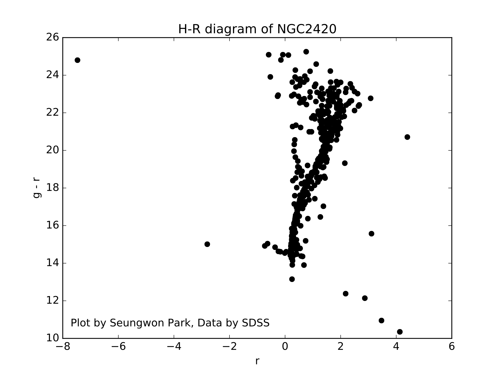

# HR-Diagram

- Software for drawing H-R diagram.
- Uses data from [SDSS DR7 Navigate Tool](http://skyserver.sdss.org/dr7/sp/tools/chart/navi.asp).
- Uses 'g'(green), 'r'(red) filter.
- Based on Python3.


## Instructions
- Fill out the form at `main.py`.
```
ra_0 = 114.543
dec_0 = 21.641
ra_1 = 114.665
dec_1 = 21.526
interval = 0.02

clustername = 'NGC2420'
```
- Run `main.py`.
> python main.py

## Example




## TODOs

- Multithreaded crawling
- GUI
