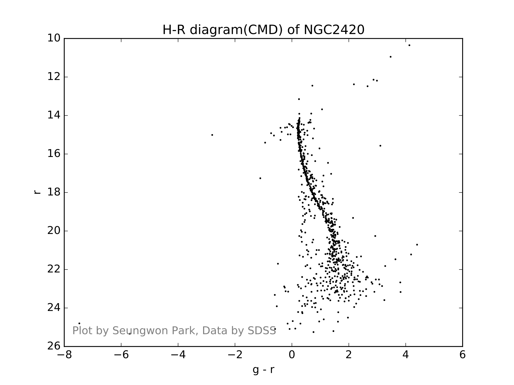

# HR-Diagram

- Software for drawing H-R diagram.
- Crawls data from [SDSS DR7 Navigate Tool](http://skyserver.sdss.org/dr7/sp/tools/chart/navi.asp).
- Uses 'g'(green), 'r'(red) filter.
- Based on Python3.


## Instructions
- Fill out the form at `ClusterInfo.ini`.
  - If you change only the threshold, then it will skip crawling data and plot directly.
- Run `main.py`.
> python main.py

## Example




## File name format
```
datafilename = 'data/%g-%g-%g-%g-%g.csv' % (ra_0, ra_1, dec_0, dec_1, interval)
plotfilename = 'diagrams/%s_%g_%s.pdf' % (clustername, threshold, datafilename[:-4].split('/')[1])
```

## TODOs

- Multithreaded crawling
- GUI
